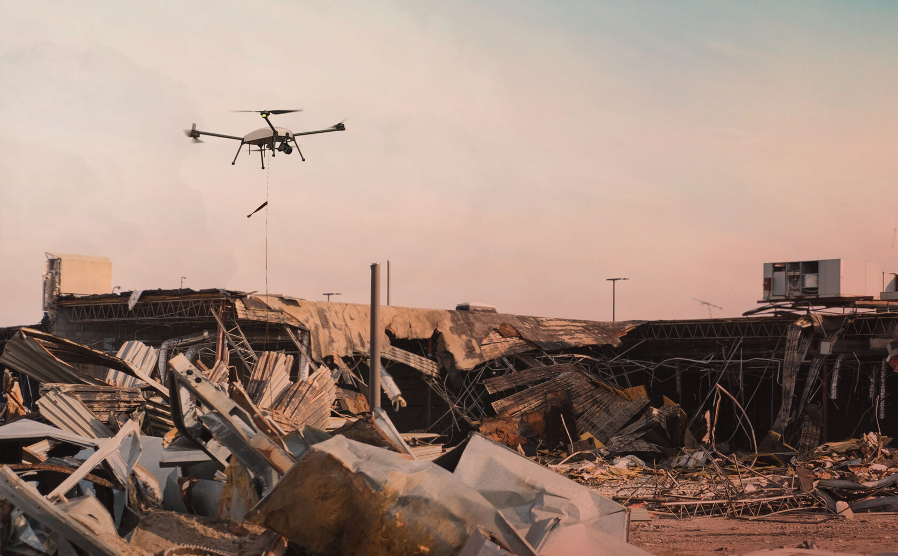

# UAV Remote Sensing Training Course Website



## Overview

This is the official website for the **UAV Remote Sensing Training Course** organized by the China Pakistan Joint Research Center (CPJRC), Institute of Geographical Information Systems (IGIS), and School of Civil & Environmental Engineering (SCEE) at NUST (National University of Sciences and Technology), Islamabad, Pakistan.

The course focuses on hands-on training in UAV remote sensing technology for disaster management applications, covering theory, practical operations, and case studies.

## Features

- **Course Information**: Detailed overview of the 4-day training program (November 17-20, 2025)
- **Curriculum Breakdown**: Day-by-day schedule with topics, activities, and detailed content
- **Expert Lecturers**: Profiles of renowned instructors from CAS and NUST
- **Registration**: Direct link to Microsoft Forms for course registration
- **Interactive Elements**:
  - Live countdown timer to event start
  - Responsive design for mobile and desktop with dedicated mobile layouts
  - Smooth scrolling and back-to-top functionality
  - Mobile-optimized schedule with card-based layout
- **Accessibility Features**: ARIA labels, keyboard navigation, semantic HTML
- **Visual Assets**: Integrated images and logos for branding

## Technologies Used

- **HTML5**: Semantic structure with accessibility features
- **Tailwind CSS**: Utility-first styling framework with custom responsive design
- **Vanilla JavaScript**: Interactive features (countdown, smooth scrolling, navigation)
- **GitHub Pages**: Hosting and deployment

## File Structure

```
NUSTCPJRC2025.github.io/
├── index.html              # Main webpage with all enhancements
├── styles.css              # External CSS styles with responsive design
├── script.js               # JavaScript functionality
├── README.md               # This file
├── audit_report.md         # Webpage audit and recommendations
├── c1harlie-deets-71DA8.jpg  # Header banner image (95% width)
├── Climate-Adaptation-Drone-Application-Disaster-Response.jpg  # Course illustration (60% width)
├── Logo_left_v2.png        # Left logo
├── NUST_logo.png           # NUST logo
└── .git/                   # Git repository
```

## Deployment

This site is deployed using **GitHub Pages**. To deploy your own version:

1. Fork or clone this repository
2. Make your changes
3. Commit and push to the `main` branch
4. Enable GitHub Pages in repository settings:
   - Go to Settings > Pages
   - Select "Deploy from a branch"
   - Choose `main` branch and `/ (root)` folder
5. Your site will be available at `https://[username].github.io/[repository-name]/`

## Local Development

To run locally:

1. Clone the repository:
   ```bash
   git clone https://github.com/NUSTCPJRC2025/NUSTCPJRC2025.github.io.git
   cd NUSTCPJRC2025.github.io
   ```

2. Open `index.html` in your browser (or use a local server for better experience)

## Course Details

- **Duration**: 4 Days
- **Dates**: November 17-20, 2025
- **Venue**: IGIS Building, NUST Sector H-12, Islamabad, 44000
- **Target Audience**: Professionals in Disaster Management, Researchers, Faculty
- **Registration**: [Click here to register](https://forms.office.com/r/2FzquZWw0f)

## Contact

For course inquiries:
- **Email**: [NUST_CPJRC_WRKSHP_2025@igis.nust.edu.pk](mailto:NUST_CPJRC_WRKSHP_2025@igis.nust.edu.pk)
- **Phone**: +923225292331, +92379375724

## Contributing

Contributions are welcome! Please:

1. Fork the repository
2. Create a feature branch
3. Make your changes
4. Submit a pull request

## License

This project is licensed under the MIT License - see the [LICENSE](LICENSE) file for details.

---

**Organized by**: CPJRC, IGIS & SCEE, NUST, Islamabad, Pakistan  
**© 2025 UAV Remote Sensing Training Course**